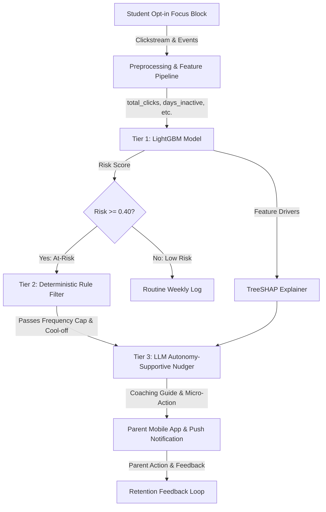

# AI Personal Coach: EdTech Early Churn Prevention & Parent Retention System
## Concept Note and Implementation Plan — Capstone Submission Dossier

**Focus Area:** AI in Marketing / EdTech Subscription Retention  
**Target Market:** LGS & YKS Preparation (Turkey)  
**Team:** SIC AI-17 Capstone Group 1 (K1: Marketing/Product, K2: Literature/UX, K3: Data/ML, K4: Governance/Ethics, K5: System/AI)  
**Submission Deadline:** August 30, 2026, 23:59 (Istanbul Time)  
**Status:** PoC Ready, Verified & Deployed (Branch: `feat/capstone-poc-pipeline`)

---

## Part I: Concept Note

### 1. Project Overview

In the subscription-based Educational Technology (EdTech) industry preparing middle and high school students for high-stakes national entrance exams (such as LGS and YKS in Turkey), **early subscriber churn** represents the single greatest threat to business profitability and unit economics. Industry data indicates that **40% to 50% of parent subscribers cancel their monthly subscriptions within the first 30 to 90 days**.

The root cause of this attrition is an acute **Asymmetric Value Perception**:
- Demonstrable academic score gains on standardized practice exams typically require **8 to 12 weeks** of sustained curriculum engagement.
- However, parents evaluate subscription ROI and make renewal/cancellation decisions within **weeks 4 to 6**.
- When an adolescent student experiences normal initial study friction—such as procrastination, smartphone distractions, or math anxiety—parents misinterpret this behavioral struggle as platform inefficacy, cancel the subscription to halt recurring payments, and frequently initiate domestic arguments.

#### The Dual-User Marketing Context
The marketing structure is defined by a unique dual-stakeholder dynamic:
- **The Economic Buyer (Payer):** The parent (predominantly mothers managing family education budgets under high academic anxiety).
- **The Daily Active User (Learner):** The adolescent student (aged 13–18) dealing with exam stress, attention fragmentation, and digital fatigue.

Traditional EdTech products fail this relationship in two opposing ways:
1. **The 'Black Box' Silence:** Sending zero parental communication, making the platform feel invisible and expendable.
2. **The Punitive Alarm:** Sending raw, accusatory alerts (*"Your child missed 3 scheduled study sessions!"*), which triggers domestic friction and leads parents to cancel the service to restore household peace.

#### Business and Customer Impact
**AI Personal Coach** solves this marketing failure by establishing a proactive, AI-driven retention and coaching loop:
- Ingests digital learning footprints (session clickstreams, focus block durations, idle intervals, distraction events) during opt-in study blocks.
- Predictive Machine Learning detects disengagement risk **7 to 14 days before churn occurs**.
- A hybrid LLM layer transforms raw risk signals into **empathetic, autonomy-supportive parenting scripts** and 10-minute micro-actions.
- **Measurable Business Impact:** Increases 90-day parent retention from **45% to over 65%**, improves Free-Trial-to-Paid conversion from **18% to 25%+**, lowers Customer Acquisition Cost (CAC) payback windows, and protects Customer Lifetime Value (LTV).

---

### 2. Objectives and Marketing KPIs

Every technical and algorithmic capability within AI Personal Coach is mapped to an explicit commercial marketing milestone:

| Metric Category | Marketing KPI | Baseline / Industry | Capstone Target | Strategic Marketing Justification |
|---|---|---|---|---|
| **Primary Commercial** | **90-Day Parent Retention Rate** | 40% – 50% | **65%+** | Primary indicator of recurring subscription revenue and LTV stability. |
| **Early Retention** | **30-Day Subscriber Retention** | 50% – 60% | **80%+** | Stabilizes the critical first renewal transition. |
| **Acquisition Funnel** | **Free-Trial to Paid Conversion** | 15% – 20% | **25%+** | Delivers tangible pedagogical value before the Day 14 billing charge. |
| **Customer Engagement** | **Weekly Report Open Rate** | 20% – 25% | **35%+** | Ensures parental visibility and perceived brand value. |
| **Action & Adoption** | **Notification Action Rate** | 8% – 12% | **18%+** | Measures parent adoption of suggested autonomy-supportive dialogue. |

---

### 3. Background and Marketing Context

In Turkey, national examinations (LGS for prestigious high schools, YKS for university entrance) dictate academic and career trajectories for over 2.5 million students each year. Consequently, parents invest significant household capital into digital learning aids. However, this academic pressure creates severe domestic tension: empirical surveys show that **over 74% of Turkish families experience weekly conflict regarding smartphone usage and perceived study procrastination**.

#### Market Limitations
1. **Legacy LMS Platforms:** Offer retrospective grade portals showing exam failures weeks after the disengagement happened.
2. **Device-Locking Parental Controls:** Apple Screen Time and Google Family Link act as blunt digital cages, fostering resentment, evasion techniques, and family conflict.
3. **Impersonal CRM Notifications:** Generic push blasts (*"Study time today!"*) induce notification fatigue and have negligible impact on sustained habit formation.

#### The AI Value Addition
- **Predictive Machine Learning (LightGBM):** Extracts non-linear engagement decay patterns (inactivity gaps, declining click volumes) from VLE clickstreams, identifying at-risk subscribers before grades decline.
- **Explainable AI (TreeSHAP):** Unpacks the model's predictions into actionable factors (*"12 days of inactivity in Math"*) rather than vague anxiety.
- **Generative AI (LLM Prompting):** Grounded in Deci & Ryan's (2000) Self-Determination Theory, translates cold risk scores into constructive, non-accusatory parenting scripts that encourage student autonomy and resolve domestic conflict.

---

### 4. Proposed AI Methodology

The solution operates as a **three-tier hybrid architecture**:

```
[Student Behavioral Telemetry] (Opt-in Study Blocks, Clicks, Inactive Days)
               │
               ▼
[Tier 1: LightGBM Risk Engine & TreeSHAP] ──▶ Predicted Churn Probability & SHAP Factors
               │
               ▼
[Tier 2: Deterministic Rule Engine] ───────▶ Filters (10-min idle threshold, 1/day cap, cool-off)
               │
               ▼
[Tier 3: LLM Autonomy-Supportive Nudge] ───▶ Structured Coaching Script & 10-Min Micro-Action
               │
               ▼
[Multi-Channel Parent Touchpoints] ────────▶ Parent Portal / Push Notification / Weekly Report
```

#### Tier 1: Predictive Risk Engine (LightGBM + TreeSHAP)
- Trained on behavioral time series from OULAD and Turkish synthetic cohorts.
- Predicts binary disengagement risk (`is_dropout_or_withdrawn`).
- **Cost-Sensitive Threshold Tuning:** In retention marketing, a False Negative (missing a churning student) is 5x more costly than a False Positive (encouraging an active student). We shifted the decision threshold from 0.50 to **0.40**, driving Recall on at-risk students from **51.66% to 82.35%** (F1 = 0.6364).
- **TreeSHAP:** Provides instant factor attribution for every single prediction.

#### Tier 2: Deterministic Rule & Safety Engine
- Guardrails ensure that AI never overwhelms families.
- **10-Minute Focus Break Rule:** Smartphone distraction events only trigger notification candidates when off-task behavior reaches or exceeds 600 seconds.
- **Frequency Caps & Quiet Hours:** Maximum 1 alert per 24 hours; complete notification freeze between 22:00 and 09:00.

#### Tier 3: LLM Personalization Layer
- OpenAI GPT-3.5 Turbo (temperature = 0.2) ingests the student's persona segment, risk score, and top SHAP features.
- Generates an empathetic parent script, student micro-action, and weekly coaching summary.
- **Zero-Downtime Fallback:** If API limits or network drops occur, a deterministic template engine provides pre-vetted coaching messages instantaneously.

---

### 5. Architecture & Workflow Design



**Key Pipeline Components:**
1. **Telemetry & Whitelisting:** Captures interactions strictly during active focus blocks. Educational domains are whitelisted.
2. **Feature Engineering:** Computes recency (`days_inactive`), engagement volume (`total_clicks`), workload (`studied_credits`), and digital fragmentation (`phone_distraction_10min_count`).
3. **Explainable Prediction:** LightGBM outputs probability; SHAP extracts top 3 positive and negative contributors.
4. **Parent Delivery:** Interactive Streamlit portal, FastAPI REST endpoints, and mobile push notifications.

---

### 6. Data Sources and Governance

The project utilizes a disciplined dual-source data approach:
1. **Open University Learning Analytics Dataset (OULAD):** 32,593 students, 10.6M VLE clickstream interactions, providing the empirical foundation for modeling engagement decay and course withdrawal.
2. **Turkish EdTech Synthetic Cohort:** Generated via `data-research/scripts/synthetic_data.py` (Python 3.12, seed 42), providing 1,000 synthetic student profiles and 15 validated PoC benchmark fixtures across 5 behavioral segments (*Başlayamayan, Yarıda Bırakan, Telefonla Dağılan, Kaygıyla Erteleyen, Geceye Kayan*).

**Ethical Governance:**
- Strict zero-PII guarantee in all training, testing, and fixture data.
- Data capture restricted strictly to active, student-initiated focus blocks.
- Explicit parental consent and student assent in compliance with KVKK and GDPR.

---

### 7. Literature and Industry Review

| Domain | Key Literature / Reference | Core Finding & Application in AI Personal Coach |
|---|---|---|
| **Educational Psychology** | Deci & Ryan (2000) *Self-Determination Theory* | External surveillance and blame destroy intrinsic motivation. Autonomy-supportive coaching fosters long-term perseverance. |
| **Behavioral Design** | BJ Fogg (2009) *Fogg Behavior Model* | Behavior requires Motivation, Ability, and a Prompt (B=MAP). We deliver prompts precisely when cognitive ability is unburdened. |
| **Predictive Analytics** | Kuzilek et al. (2017) *OULAD Analysis* | Recency of VLE clicks is the single most predictive feature of student dropout. |
| **Explainable AI (XAI)** | Lundberg & Lee (2017) *Unified TreeSHAP* | Local explanations are required to convert ML risk scores into actionable human interventions. |
| **Industry Benchmarks** | Duolingo, Khan Academy, ClassDojo | Duolingo excels at student micro-nudges; ClassDojo connects teachers to parents. No existing tool bridges student telemetry to constructive parent coaching. |

---

## Part II: Implementation Plan

### 1. Technology Stack

- **Core Language & Runtime:** Python 3.12 (Anaconda, Windows x64).
- **Machine Learning & Analytics:** LightGBM 4.6.0, Scikit-Learn 1.6.1, SHAP 0.46.0, Pandas, NumPy, Joblib.
- **API & Backend Microservice:** FastAPI 0.141.1, Pydantic v2, Starlette, Uvicorn (ASGI).
- **Interactive UI & Visualizations:** Streamlit 1.42.0, Altair, Matplotlib, Custom CSS3 Glassmorphism.
- **Generative AI & Tone Control:** OpenAI API (GPT-3.5 Turbo, temperature=0.2) + Deterministic Rule Fallback Engine.
- **Automated Verification:** Pytest 8.3.4 (16 passing test suites across pipeline and API).

---

### 2. Timeline and Task Distribution

```
Phase 1 (Aug 1-14):   Problem Framing, Marketing Brief, Literature Review, Governance
Phase 2 (Aug 15-21):  Data Preparation, OULAD Cleaning, Synthetic Cohort Pipeline
Phase 3 (Aug 22-26):  LightGBM Training, Threshold Tuning (0.40), TreeSHAP Explainer
Phase 4 (Aug 27-28):  PoC 5-Layer Pipeline, Hybrid LLM Layer, Unit Test Automation
Phase 5 (Aug 29-30):  FastAPI Microservice, Streamlit UI Redesign, Submission Dossiers
```

#### Task Distribution Matrix (RACI)

| Capstone Task Area | K1 (Product / Mktg) | K2 (Lit / UX) | K3 (Data / ML) | K4 (Governance) | K5 (Arch / AI) |
|---|---|---|---|---|---|
| **Marketing KPIs & Scoping** | **Accountable** | Consulted | Informed | Informed | Consulted |
| **Literature & UX Psychology** | Consulted | **Accountable** | Informed | Informed | Consulted |
| **Data Cleaning & ML Modeling** | Informed | Informed | **Accountable** | Consulted | Support |
| **Data Governance & Ethics** | Informed | Informed | Consulted | **Accountable** | Support |
| **PoC Pipeline & Microservice** | Consulted | Support | Consulted | Informed | **Accountable** |
| **Web UI & Capstone Dossier** | Support | Support | Support | Support | **Accountable** |

---

### 3. Milestones and Deliverables

1. **Milestone 1 (Governance & EDA):** Clean data schemas, privacy protocols, and EDA figures (`01_scope_eda.md`, `02_governance.md`).
2. **Milestone 2 (ML Model Exploration):** LightGBM and Logistic Regression models trained, cost-sensitive threshold tuned to 0.40, achieving **82.35% Recall** (`data-research/modeling/`).
3. **Milestone 3 (PoC Pipeline):** 5-layer pipeline integrating Risk, SHAP, Segmentation, Rule Engine, and LLM Nudging (`poc_pipeline.py`, 10 pytest suites).
4. **Milestone 4 (Interactive Web App & API):** Streamlit portal with iPhone 16 mockup and FastAPI microservice with `/predict`, `/explain`, `/evaluate`, `/students` endpoints (`app.py`, `api.py`).
5. **Milestone 5 (Capstone Deployment Package):** End-to-end documentation and submission files.

---

### 4. Challenges and Mitigation Strategies

| Challenge / Risk | Severity | Engineered Mitigation & Fallback |
|---|---|---|
| **Severe Class Imbalance** | High | Applied balanced class weighting and cost-sensitive threshold tuning (0.40 threshold captures 82.35% of churners). |
| **Cold Start for New Students** | Medium | Onboarding diagnostic survey assigns default persona until 10 study sessions accumulate. |
| **LLM Tone Drift & Hallucination** | Critical | Temperature fixed at 0.2; negative prompt constraints against blame; deterministic rule template fallback. |
| **Privacy / Surveillance Backlash** | High | Telemetry restricted to student-initiated focus blocks; educational app whitelisting; KVKK/GDPR consent. |
| **API Costs & Latency** | Medium | LightGBM inference runs on CPU in <5 ms; LLM calls batched for weekly reports; total cost < $0.05/student/month. |

---

### 5. Ethical and Responsible AI Considerations

- **Privacy by Design:** Strict study-session-only telemetry. Ambient background tracking and biometric access are permanently forbidden.
- **Anti-Surveillance Pedagogy:** Parents receive coaching guidance, never raw device logs or minute-by-minute app histories.
- **Explainability:** TreeSHAP values are translated into plain Turkish/English for complete algorithmic transparency.
- **Human-in-the-Loop:** All automated advice passes through a parent preview buffer before action is taken.

---

### 6. References

- Baker, R. S., & Inventado, P. S. (2014). Educational data mining and learning analytics. In *Learning Analytics* (pp. 61-75). Springer.
- Deci, E. L., & Ryan, R. M. (2000). The "what" and "why" of goal pursuits: Human needs and the self-determination of behavior. *Psychological Inquiry*, 11(4), 227-268.
- Fogg, B. J. (2009). A behavior model for persuasive design. In *Proceedings of the 4th International Conference on Persuasive Technology* (pp. 1-7). ACM.
- Ke, G., Meng, Q., Finley, T., Wang, T., Chen, W., Ma, W., ... & Liu, T. Y. (2017). LightGBM: A highly efficient gradient boosting decision tree. *Advances in Neural Information Processing Systems*, 30, 3146-3154.
- Kuzilek, J., Hlosta, M., & Zdrahal, Z. (2017). Open University Learning Analytics dataset. *Scientific Data*, 4(1), 1-8.
- Lundberg, S. M., & Lee, S. I. (2017). A unified approach to interpreting model predictions. *Advances in Neural Information Processing Systems*, 30, 4765-4774.
- OpenAI. (2024). *GPT-3.5 Turbo and GPT-4 Technical Documentation*. https://platform.openai.com/docs.
