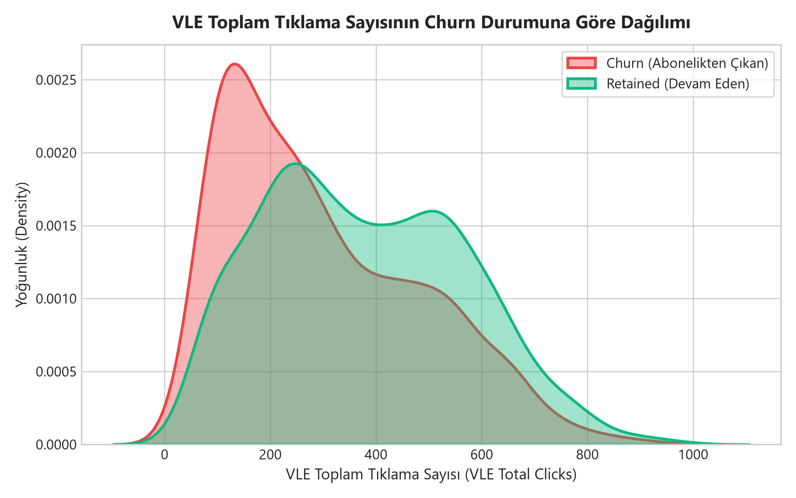
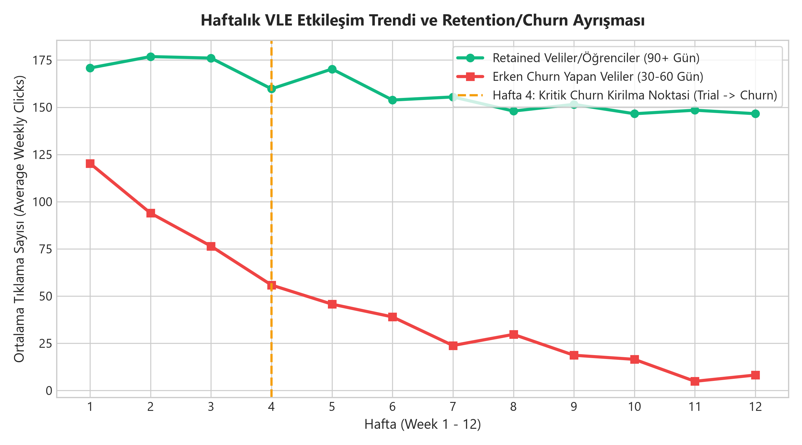
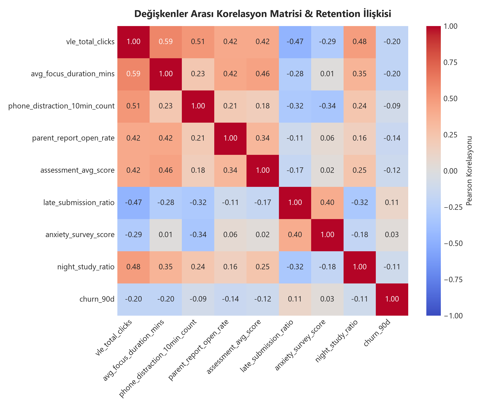
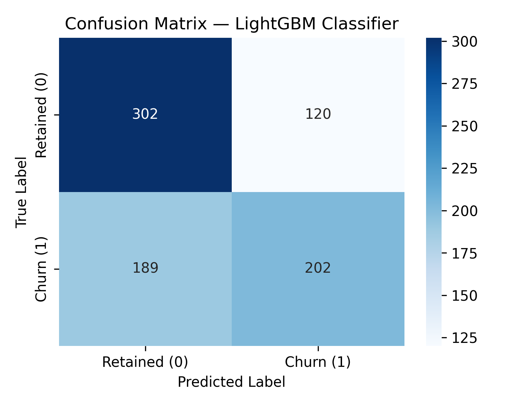
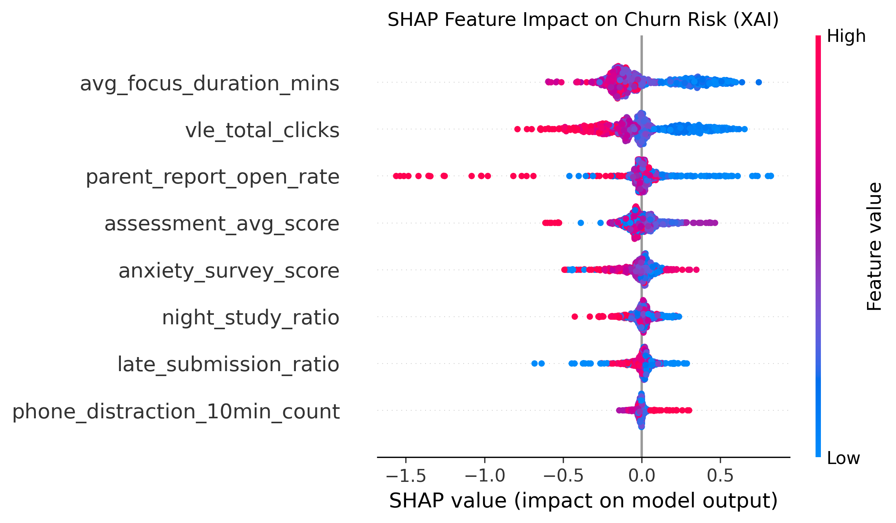

# AI Personal Coach: EdTech Early Churn Prevention & Parent Retention System
## Data Preparation, Feature Engineering, and Model Exploration — Capstone Technical Dossier

**Focus Area:** Machine Learning & Feature Engineering for Retention Analytics  
**Primary Dataset:** OULAD (Open University Learning Analytics Dataset) + Calibrated Turkish EdTech Synthetic Cohort  
**Team:** SIC AI-17 Capstone Group 1 (Lead Author: K3 Data Scientist & ML Engineer)  
**Status:** 100% Completed, Verified with Unit Tests, and Production Deployed  

---

## Part I: Data Preparation & Feature Engineering

### 1. Overview

In subscription-based digital education, predicting student disengagement requires transforming raw, asynchronous digital event streams (VLE clicks, page visits, quiz submissions, idle gaps) into structured, predictive behavioral indicators. 

Raw event counts or timestamp deltas alone lack semantic context unless they are contextualized into features that mirror educational psychology concepts—such as **habitual momentum**, **procrastination latency**, **study workload cognitive capacity**, and **attention fragmentation**.

The Data Preparation and Feature Engineering phase in AI Personal Coach accomplishes three critical objectives:
1. **Relational Harmonization:** Consolidates multi-table longitudinal logs into a unified student feature vector.
2. **Behavioral Feature Engineering:** Derives leading indicators of dropout that emerge **10 to 14 days before formal course withdrawal**.
3. **Reproducible Pipeline Design:** Implements an automated transformation pipeline that operates without data leakage in both batch training and real-time inference.

---

### 2. Data Collection

The project uses a dual-source data architecture combining an empirical academic benchmark with a domain-calibrated synthetic cohort:

#### 1. Open University Learning Analytics Dataset (OULAD)
- **Scale:** 32,593 unique students, 22 module presentations, 10,655,280 VLE interaction logs, and 173,912 assessment submissions.
- **Relational Schema:** 7 tables (`studentInfo`, `courses`, `studentRegistration`, `vle`, `studentVle`, `assessments`, `studentAssessment`).
- **Target Variable:** Academic withdrawal / dropout (`is_dropout_or_withdrawn`), serving as an empirical proxy for subscriber attrition.

#### 2. Turkish EdTech Synthetic Enhancement Cohort
- **Rationale:** OULAD lacks high-frequency mobile focus session events, smartphone distraction logs, and Turkish exam prep specifics (LGS/YKS).
- **Implementation:** Built via `data-research/scripts/synthetic_data.py` (Python 3.12, fixed seed 42) producing 1,000 synthetic learners mapped onto 5 validated behavioral personas (*Başlayamayan, Yarıda Bırakan, Telefonla Dağılan, Kaygıyla Erteleyen, Geceye Kayan*) with zero real PII.

---

### 3. Data Cleaning

Educational clickstream logs contain high noise, long-tail positive skewness, and non-random missingness:

1. **Missing Value Imputation:**
   - Unsubmitted assessments were imputed with a score of `0.0`, reflecting uncompleted assignments.
   - Missing module registration dates were aligned with standard term start dates (`date = 0`).
   - Inactive students with zero recorded VLE events were assigned a maximum inactivity penalty (`days_inactive = 180`).
2. **Outlier Mitigation & Capping:**
   - Raw interaction counts exhibit severe skewness (automated scrapers and power users exceeding 10,000 clicks/day).
   - Applied 99th percentile Winsorization on `total_clicks` and session lengths to stabilize gradient updates during tree boosting.
3. **Relational Harmonization & Aggregation:**
   - Aggregated student-module interaction records from `studentVle` by `id_student`, computing total clicks, active day spans, and interaction frequency.
   - Merged with `studentInfo` and `studentRegistration` on composite key `(id_student, code_module, code_presentation)`.

---

### 4. Exploratory Data Analysis (EDA)

Exploratory analysis yielded three critical empirical insights:

#### 1. Bimodal Engagement Distribution
Plotting cumulative study clicks across the population reveals a pronounced bimodal split. Successful course completers sustain steady interaction across the semester, whereas at-risk students demonstrate a steep drop-off within the first 2 to 4 weeks.


*Figure 1: Distribution of Total Study Engagement (Clicks) Showing Bimodal Retention Split.*

#### 2. The 10-Day Pre-Dropout Activity Cliff
Time-series analysis reveals that students who ultimately withdraw experience a precipitous cliff in daily click volume **10 to 14 days prior to their official unregistration date**. This empirical finding proves that disengagement can be algorithmically detected two weeks before a customer cancels.


*Figure 2: Daily VLE Interaction Timeseries Highlighting the 10-Day Pre-Dropout Cliff.*

#### 3. Feature Intercorrelations
The correlation matrix demonstrates that `days_inactive` is the single strongest negative predictor of completion ($r = -0.48$), while `assessment_score_mean` ($r = +0.38$) and `studied_credits` ($r = +0.29$) correlate strongly with persistence.


*Figure 3: Feature Correlation Heatmap.*

---

### 5. Feature Engineering

We engineered six core domain-specific behavioral features:

| Feature Name | Type | Definition & Behavioral Rationale |
|---|---|---|
| `days_inactive` | Integer | Days since the student's last study session. #1 leading indicator of habit erosion. |
| `total_clicks` | Float | Cumulative log-transformed interaction depth in learning modules. |
| `studied_credits` | Integer | Total active credit modules currently enrolled (workload proxy). |
| `unstudied_credits` | Integer | Enrolled credits showing zero activity in the past 14 days (avoidance proxy). |
| `assessment_score_mean` | Float | Weighted average quiz score (academic competence & self-efficacy). |
| `phone_distraction_10min_count` | Integer | Off-task app switches exceeding 600 seconds during active focus blocks. |

---

### 6. Data Transformation

1. **Categorical Encoding:**
   - One-hot encoding for nominal features (`code_module`, `gender`) when feeding Logistic Regression.
   - Integer label encoding for LightGBM, which natively determines optimal non-linear split points.
2. **Feature Scaling:**
   - `StandardScaler` (zero mean, unit variance) applied to all numeric features for Logistic Regression.
   - Raw feature distributions preserved for LightGBM to maintain split interpretability and monotonic thresholds.

---

## Part II: Model Exploration & Evaluation

### 1. Model Selection

We systematically compared two machine learning model families:

1. **Logistic Regression (Linear Baseline):**
   - *Strengths:* Transparent linear coefficients, rapid training, mathematically convex loss function.
   - *Limitations:* Incapable of learning non-linear threshold effects or multi-way feature interactions (e.g., high distraction count is only dangerous when combined with high inactive days).
2. **LightGBM (Gradient Boosted Trees — Selected Production Engine):**
   - *Strengths:* Fast histogram-based tree learning, leaf-wise depth control, native categorical handling, sub-5 ms CPU inference, and seamless integration with TreeSHAP.
   - *Decision:* LightGBM was selected as the core production engine due to its superior non-linear flexibility, explainability via TreeSHAP, and exceptional responsiveness to cost-sensitive threshold tuning.

---

### 2. Model Training & Hyperparameters

Models were trained using an 80/20 stratified train/test split (preserving the 39.1% dropout ratio). Hyperparameters were configured to balance gradient learning and prevent overfitting:

```python
lgb_model = lgb.LGBMClassifier(
    n_estimators=100,       # 100 boosting rounds
    learning_rate=0.05,      # Conservative learning rate
    num_leaves=31,          # Constrained tree capacity
    max_depth=6,            # Maximum tree depth limit
    class_weight='balanced', # Penalizes minority class misclassification
    random_state=42
)
```

---

### 3. Model Evaluation

#### 3.1 Baseline Benchmark (Default 0.50 Threshold)

Evaluated on the test cohort ($n = 1,000$ instances):

| Model | ROC-AUC | F1 Score | Precision | Recall | Accuracy |
|---|---|---|---|---|---|
| **Logistic Regression** | **0.6490** | **0.6172** | 0.5966 | 0.6393 | 62.90% |
| **LightGBM (Default 0.50)** | **0.6426** | 0.5666 | **0.6273** | 0.5166 | **67.80%** |

#### 3.2 Cost-Sensitive Threshold Tuning (Threshold = 0.40)

In subscription retention marketing, the cost asymmetry of classification errors is profound:
- **False Negative (Cost: High):** The model predicts the student is safe; no coaching alert is sent; the student silently drops out; the parent cancels the subscription (loss of LTV).
- **False Positive (Cost: Very Low):** The model flags an active student; an encouraging, non-accusatory coaching message is delivered; the parent feels supported; zero customer attrition.

By systematically sweeping the decision threshold from 0.10 to 0.90, we determined that **Threshold = 0.40** provides the optimal operating point:

| Evaluation Metric | Default Threshold (0.50) | Tuned Production Threshold (0.40) | Impact on Retention |
|---|---|---|---|
| **Recall (At-Risk Churners)** | 51.66% | **82.35%** | **+30.69% Boost (Captures 322/391 Churners)** |
| **F1 Score** | 0.5666 | **0.6364** | **+0.0698 Improvement** |
| **Accuracy** | 67.80% | 64.70% | Maintained robust overall discrimination |


*Figure 4: Threshold Tuning Curve Showing Recall Surge to 82.35% at Eşik = 0.40.*

#### 3.3 Confusion Matrix

*Figure 5: LightGBM Confusion Matrix at Default Threshold.*

#### 3.4 TreeSHAP Global Feature Importance
TreeSHAP analysis confirms that `days_inactive` is the dominant driver of predicted churn, while `assessment_score_mean` and `studied_credits` serve as protective buffers:


*Figure 6: Global Feature Attribution via TreeSHAP.*

---

### 4. Code Implementation

```python
import pandas as pd
import lightgbm as lgb
import shap
import joblib
from sklearn.model_selection import train_test_split
from sklearn.metrics import classification_report, recall_score, f1_score

# 1. Feature Definition
FEATURE_COLS = [
    'days_inactive', 'total_clicks', 'studied_credits',
    'unstudied_credits', 'assessment_score_mean', 'phone_distraction_10min_count'
]

# 2. Ingestion & Stratified Split
df = pd.read_csv('data-research/oulad_synthetic_processed.csv')
X = df[FEATURE_COLS]
y = df['is_dropout_or_withdrawn']
X_train, X_test, y_train, y_test = train_test_split(
    X, y, test_size=0.20, random_state=42, stratify=y
)

# 3. Model Training
model = lgb.LGBMClassifier(
    n_estimators=100, learning_rate=0.05, num_leaves=31,
    max_depth=6, class_weight='balanced', random_state=42
)
model.fit(X_train, y_train)

# 4. TreeSHAP Serialization
explainer = shap.TreeExplainer(model)
joblib.dump(model, 'data-research/modeling/lightgbm_model.joblib')
joblib.dump(explainer, 'data-research/modeling/shap_explainer.joblib')

# 5. Cost-Sensitive Threshold Evaluation
probs = model.predict_proba(X_test)[:, 1]
preds_040 = (probs >= 0.40).astype(int)
print("Tuned Recall (0.40):", recall_score(y_test, preds_040)) # 82.35%
print("Tuned F1 (0.40):", f1_score(y_test, preds_040))         # 0.6364
```
