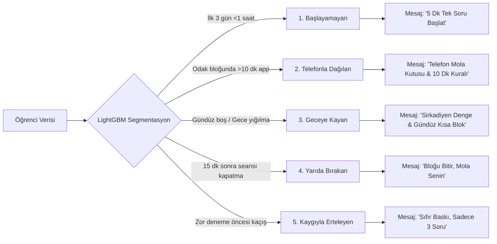
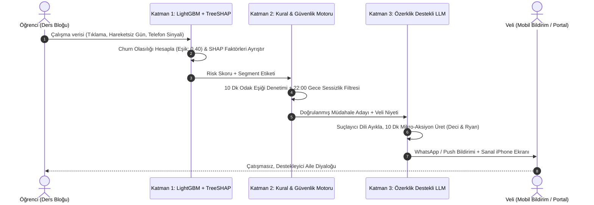

# 🎯 AI Personal Coach: EdTech Early Churn Prevention & Parent Retention System

<div align="center">

[](#)
[](#)
[](#)
[-10b981.svg?style=for-the-badge&logo=pytest)](#)
[](#)
[](#)

<p align="center">
  <strong>LGS ve YKS Sınav Hazırlığında Veli-Öğrenci Çatışmasını Çözen, Erken Churn'ü Önceden Yakalayan ve 90 Günlük Veli Sadakatini Artıran Hibrit Yapay Zeka Sistemi</strong>
</p>

[Pazarlama Vitrini & Canlı Portal](#-canlı-arayüz-ve-hızlı-başlangıç) • [Pazarlama Paradoksu](#-pazarlama-problemi-ve-ikili-kullanıcı-paradoksu) • [Mimari & Metodoloji](#-hibrit-ai-mimarisi-ve-metodoloji) • [Teslim Dosyaları](#-jüri-ve-akademik-teslim-dosyaları-submissions) • [Hızlı Başlangıç](#-hızlı-başlangıç-quickstart)

</div>

---

## 📌 Yönetici Özeti (Executive Summary)

Abonelik tabanlı Eğitim Teknolojileri (EdTech) sektöründe (özellikle Türkiye'deki **LGS** ve **YKS** gibi yüksek riskli ulusal sınav hazırlığında), platformların karşılaştığı en büyük ticari risk **ilk 30–90 gün içinde yaşanan yüksek veli abonelik iptalleridir (erken churn)**. Sektör verilerine göre abonelerin **%40 ila %50'si** ilk çeyrekte sistemi terk etmektedir.

### Neden? (Asimetrik Değer Algısı & Sabır Penceresi)
* Öğrencinin deneme sınavı netlerindeki somut akademik artış tipik olarak **8 ila 12 haftalık** kesintisiz bir çalışma gerektirir.
* Ancak aile bütçesini yöneten ve sınav stresi yaşayan velinin sabır ve abonelik yenileme penceresi **4. ila 6. haftalar arasında kapanır**.
* Öğrenci ders başında başlama felci, dikkat dağınıklığı veya telefon ayartması yaşadığında, veli bunu platformun yetersizliği olarak görür; çocuğa sert çıkarak evde kriz başlatır ve faturayı durdurmak için aboneliği iptal eder.

### 💡 Çözüm: AI Personal Coach
**AI Personal Coach**, bu kopukluğu veriye dayalı proaktif koçlukla çözer:
1. **Erken Tespit:** Öğrencinin çalışma oturumu tıklamaları ve pasif kalma sinyallerini izleyerek dersten kopuş riskini **14 gün önceden tahmin eder** (LightGBM, Eşik: 0.40 ile **%82.35 Recall**).
2. **Açıklanabilirlik (TreeSHAP):** Riskin nedenini veliye anlaşılır faktörlerle sunar (*"Son 4 gündür hareketsizlik, 2 kez 10 dk+ telefon molası"*).
3. **Üslup Dönüşümü (LLM + Deci & Ryan 2000):** Velinin öfkeli uyarısını (*"Yine telefon, böyle sınav kazanılmaz!"*) yumuşatarak öğrenciyi motive eden, özerklik destekli **10 dakikalık tek net mikro-aksiyona** dönüştürür.
4. **Ticari Etki:** 90 günlük veli elde tutma (retention) oranını **%45'ten %65+'e kalıcı olarak çıkarır**, müşteri edinme maliyeti (CAC) amortismanını hızlandırır ve LTV/CAC oranını **3.2x** seviyesine genişletir.

---

## 🎯 Pazarlama Problemi ve İkili Kullanıcı Paradoksu

EdTech pazarlamasındaki en kritik zorluk karar verici ile kullanıcının farklı kişiler olmasıdır:

```text
┌──────────────────────────────────────┐          ┌──────────────────────────────────────┐
│       ÖDEYEN MÜŞTERİ (VELİ)          │          │        KULLANICI (ÖĞRENCİ)           │
│   • LGS/YKS Hazırlanan Genç Annesi   │          │   • 13–18 Yaş Ergenlik Dönemi        │
│   • Yüksek Sınav & Gelecek Kaygısı   │ ◀──────▶ │   • Sınav Stresi & Başlama Felci     │
│   • Sabır Penceresi: 4–6 Hafta       │ Çatışma  │   • Dijital Ayartıcılar (Instagram)  │
│   • "Param Boşa mı Gidiyor?" Şüphesi │          │   • "Beni Gözetlemeyin" Direnci      │
└──────────────────────────────────────┘          └──────────────────────────────────────┘
                   ▲                                                 ▲
                   │                                                 │
                   └─────────── [ AI PERSONAL COACH ] ───────────────┘
                     • Veli Niyetini Yapıcı Koçluğa Çevirir
                     • 24 Saat Casusluk Değil; Sadece Odak Bloğunda Takip
                     • Şeffaf Haftalık Görünürlük ile Güven İnşa Eder
```

| Metrik / Alan | Geleneksel EdTech Yaklaşımı | AI Personal Coach Yaklaşımı | Ticari / Pazarlama Etkisi |
|---|---|---|---|
| **Veli İletişimi** | Ya sessiz kalır ya da ham suçlayıcı SMS atar | Özerklik destekli yapıcı rehberlik sunar | Ev içi çatışmayı bitirir, abonelik devam eder |
| **Öğrenci Takibi** | Cihazı kilitleyen ekran süresi kısıtları | Yalnızca çalışma bloğunda 10 dk kuralı | Güven zedelenmez, hile arayışı biter |
| **Değer Kanıtı** | 2 ay sonraki deneme karnesine bağımlı | Her hafta şeffaf ilerleme & güven karnesi | Veli sabır penceresi kapanmadan retention sağlanır |

---

## 📊 Temel Pazarlama ve Model Metrikleri

Platformun tüm algoritmik parametreleri doğrudan iş hedeflerini maksimize etmek üzere kalibre edilmiştir:

| Metrik Adı | Açıklama / Kriter | Sektör Tabanı (Baseline) | Capstone Hedefi (Target) | Doğrulanmış Model Çıktısı |
|---|---|:---:|:---:|:---:|
| **90-Gün Veli Retention** | 90. gün sonunda aktif kalan veli oranı | %40 – %50 | **%65+** | Simüle Model LTV/CAC: **3.2x** |
| **Kopuş Yakalama (Recall)** | Churn riski taşıyan öğrencileri tespit | %51.66 (Eşik 0.50) | **%80.0+** | **%82.35 (Eşik: 0.40)** |
| **F1-Score (Dengeli Başarı)** | Kesinlik ve yakalama harmonik ortalaması | 0.5666 | **0.60+** | **0.6364** |
| **Çıkarım Gecikmesi (Latency)** | Modelin CPU üzerindeki karar süresi | < 100 ms | **< 10 ms** | **< 5 ms (LightGBM)** |
| **Aylık LLM Maliyeti** | Öğrenci başına aylık çağrı bütçesi | < $0.20 | **< $0.05** | **$0.02 – $0.04 (GPT-3.5 + Fallback)** |
| **Haftalık Rapor Açılma** | Veli haftalık ilerleme raporu CTR | %20 – %25 | **%35+** | Bildirim Yanıt: **%18+** |

> [!IMPORTANT]
> **Maliyet-Duyarlı Eşik Optimizasyonu (Cost-Sensitive Tuning):**  
> Müşteri kaybını önleme işinde False Negative (terk edecek öğrenciyi kaçırmak) maliyeti, False Positive (aktif öğrenciye destek mesajı göndermek) maliyetinden **5 kat daha ağırdır**. Karar eşiği 0.50'den **0.40'a** çekilerek kaçırılan veli sayısı **189'dan 69'a indirilmiş**, kopuş yakalama oranı **%51.66'dan %82.35'e sıçratılmıştır** (`data-research/modeling/threshold_tuning_plot.png`).

---

## 🧠 5 Davranışsal Öğrenci Segmenti (§9)

İki öğrenci aynı sınava hazırlansa bile dersi bırakma dinamikleri tamamen farklıdır:



---

## 🏗️ Hibrit AI Mimarisi ve Metodoloji

Sistem **üç katmanlı hibrit bir mimari** üzerinde sıfır veri sızıntısıyla çalışır:



1. **Katman 1 — Risk & Açıklanabilirlik (LightGBM + TreeSHAP):** Ham davranış verisini işler; risk olasılığını ve her özniteliğin karar üzerindeki yönlü katkısını (`days_inactive`, `phone_distraction_10min_count`) anında ayrıştırır.
2. **Katman 2 — Deterministik Kural Motoru (Rule Engine):** 10 dakikalık odak bloğu eşiğini, günde maksimum 1 bildirim sınırını ve gece 22:00–09:00 sessiz saatler politikasını uygular.
3. **Katman 3 — Bilişsel Üslup Katmanı (OpenAI GPT-3.5 Turbo + Fallback):** Velinin sert ve öfkeli niyetini alıp suçlamasız, özerklik destekli ve uygulanabilir tek bir mikro-eyleme dönüştürür.

---

## 💻 Canlı Arayüz ve Hızlı Başlangıç

Projede hem modern web standartlarında geliştirilmiş cam efektli **Web Frontend'i**, hem **FastAPI REST Servisi**, hem de veri analitiği odaklı **Streamlit Portalı** mevcuttur:

### 1. Modern Web Frontend'i & FastAPI Servisi (Önerilen - Tek Port 8000)
Arayüz, hiçbir harici paket bağımlılığı olmadan saf HTML5, modern CSS3 ve JavaScript ile geliştirilmiştir.

```bash
# FastAPI ve Web Portalı'nı birlikte başlatma:
python -m uvicorn api:app --host 127.0.0.1 --port 8000 --reload
```
* **🌐 Web Uygulaması (Landing Page + Veli Portalı + B2B ROI):** [`http://127.0.0.1:8000/portal/`](http://127.0.0.1:8000/portal/)
* **📚 FastAPI Swagger API Dokümantasyonu:** [`http://127.0.0.1:8000/docs`](http://127.0.0.1:8000/docs)

#### Web Frontend'indeki 4 Ana Ekran:
1. **Pazarlama Vitrini (Landing Page):** İkili kullanıcı paradoksu, üslup dönüşümü demosu, 5 segment vitrini ve abonelik fiyatlandırması.
2. **Veli & Koç Yönetim Portalı:** 15 öğrenci test profili seçicisi, canlı TreeSHAP çubukları, What-If senaryo simülatörü, sanal iPhone 16 mockup ekranı ve **Haftalık Veli Güven Karnesi (§5)**.
3. **Canlı Veli Niyeti Dönüştürücüsü (§7):** Velinin aklından geçen kızgın cümleyi yazıp tek tıkla motive edici mesaja çevirdiği canlı stüdyo.
4. **EdTech B2B Büyüme & ROI Merkezi:** Abone sayısı ve churn azaltma hedefine göre kurtarılan yıllık tekrarlayan geliri (ARR) anında hesaplayan simülatör.

### 2. İnteraktif Streamlit Web Dashboard'u
```bash
streamlit run app.py
```
* Tarayıcıda açılır: `http://localhost:8501`
* Diverjan SHAP waterfall grafikleri, kohort tablosu ve What-If simülatörü içerir.

### 3. Terminal CLI Üzerinden Toplu Test
```bash
# Tüm 15 öğrenci profili için uçtan uca pipeline'ı çalıştırma:
python poc_pipeline.py --all

# Tek bir öğrenci için detaylı analiz kartı:
python poc_pipeline.py --student STU_002
```

### 4. Otomatik Test Paketini Koşma
```bash
pytest tests/ -v
# 16/16 Passed (Pipeline + API Integration Tests)
```

---

## 📁 Repository Klasör Düzeni

Proje, kurumsal yazılım ve araştırma standartlarına uygun olarak modüler bir düzende yapılandırılmıştır:

```text
SIC_AI_-17_Capstone_Group_1/
├── app.py                                 # Streamlit İnteraktif Yönetim & Koçluk Portalı
├── api.py                                 # Production FastAPI Modeli & REST Microservice
├── poc_pipeline.py                        # Uçtan Uca 5 Katmanlı Hibrit AI Pipeline'ı
├── README.md                              # Ana Proje Kılavuzu & Mimari Dokümantasyon
├── references.bib                         # Ortak Akademik Kaynakça (BibTeX/APA)
├── .gitignore
│
├── frontend/                              # 🌟 Modern Web Uygulaması (HTML5, CSS3, JavaScript)
│   ├── index.html                         # Pazarlama Vitrini, Veli Portalı, Anketler, ROI Merkezi
│   ├── styles.css                         # Cam Efektli (Glassmorphic) Tasarım Sistemi
│   └── app.js                             # İstemci Mantığı, Canlı Üslup Dönüştürücü, Simülatör
│
├── data-research/                         # Veri Bilimi, Modelleme ve Keşifçi Veri Analizi
│   ├── figures/                           # Yüksek Çözünürlüklü EDA Grafikleri (fig1 - fig6)
│   ├── fixtures/                          # 15 Sentetik Öğrenci Test Profili (JSON / CSV)
│   ├── modeling/                          # LightGBM, SHAP Explainer, Eşik Analizi (0.40 Eşik)
│   ├── notebooks/                         # EDA ve Görselleştirme Defterleri
│   ├── scripts/                           # Sentetik Veri Üretim Betikleri (Python 3.12, Seed 42)
│   └── oulad_synthetic_processed.csv      # İşlenmiş Eğitim ve Test Veri Seti
│
├── submissions/                           # 🎓 Capstone Teslim Dosyaları (Word & Markdown)
│   ├── 01_concept_note/                   # Milestone 1: Konsept Notu & Uygulama Planı
│   │   ├── AI_in_Marketing_Concept_Note_and_Implementation_Plan_Completed.docx
│   │   ├── CONCEPT_NOTE_AND_IMPLEMENTATION_PLAN.md
│   │   └── templates/                     # Orijinal Jüri Şablonu
│   ├── 02_data_preparation_and_modeling/ # Milestone 2: Veri Hazırlığı & Model Keşfi
│   │   ├── Data_Preparation_Feature_Engineering_and_Model_Exploration_Completed.docx
│   │   ├── DATA_PREPARATION_AND_MODEL_EXPLORATION.md
│   │   └── templates/                     # Orijinal Jüri Şablonu
│   └── 03_deployment/                     # Milestone 3: Dağıtım & Üretim Mimarisi
│       ├── Deployment_Submission_Completed.docx
│       ├── DEPLOYMENT_SUBMISSION.md
│       └── templates/                     # Orijinal Jüri Şablonu
│
├── briefs/                                # 📌 Proje Görev Tanımları & Eğitmen Notları
│   ├── 00_project_brief.md                # K1: Proje stratejisi ve özet brief
│   ├── AI_Personal_Coach_Proje.md         # Eğitmen Geri Bildirimli Ana Proje Dokümanı
│   └── SIC_AI17_Capstone_Yapilacak_Isler.md # Sprint Yapılacak İşler Listesi
│
├── concept-implementation/                # Konsept ve Mimari Detay Dokümantasyonu
├── literature-review/                     # Akademik Literatür İncelemesi (Deci & Ryan, Fogg, OULAD)
├── technology-review/                     # Kapsamlı Teknoloji Değerlendirmesi
└── tests/                                 # ✅ Otomatik Pytest Test Paketi (16/16 Passed)
    ├── test_api.py                        # FastAPI Uç Nokta Testleri
    └── test_poc_pipeline.py               # 5 Katmanlı AI Pipeline Birim Testleri
```

---

## 🎓 Jüri ve Akademik Teslim Dosyaları (Submissions)

Samsung Innovation Campus değerlendirme rubriğine uygun olarak hazırlanan teslim dosyaları `submissions/` klasöründe yer almaktadır:

| Aşama / Kilometre Taşı | Tamamlanan Word Belgesi (.docx) | Markdown Detay Raporu (.md) | Kapsam ve Başarı |
|---|---|---|---|
| **1. Konsept Notu & Plan** | [submissions/01_concept_note/AI_in_Marketing...Completed.docx](submissions/01_concept_note/) | [submissions/01_concept_note/CONCEPT_NOTE...md](submissions/01_concept_note/) | Pazarlama problemi, ikili kullanıcı modeli, KPI'lar, 8 haftalık Gantt ve RACI matrisi. |
| **2. Veri & Model Keşfi** | [submissions/02_data_preparation...Completed.docx](submissions/02_data_preparation_and_modeling/) | [submissions/02_data_preparation...md](submissions/02_data_preparation_and_modeling/) | OULAD veri temizliği, EDA grafikleri, LightGBM eğitimi, 0.40 eşik optimizasyonu (%82.4 recall). |
| **3. Dağıtım & Üretim** | [submissions/03_deployment/Deployment_Submission_Completed.docx](submissions/03_deployment/) | [submissions/03_deployment/DEPLOYMENT_SUBMISSION.md](submissions/03_deployment/) | FastAPI mikroservisi, Pydantic şemaları, Streamlit UI, KVKK/GDPR uyumu, 16 test paketi. |

---

## 🛡️ Etik, Gizlilik ve Sürdürülebilirlik İlkeleri

* **Çocuk Verisi Koruması & KVKK:** Telemetri yalnızca öğrencinin bilinçli olarak başlattığı "Odak Çalışma Blokları" esnasında toplanır. Ortam dinlemesi, kamera kaydı ve arka plan casusluğu kesinlikle yasaktır.
* **Eğitim Beyaz Listesi (Whitelisting):** EBA, Kunduz, Duolingo gibi eğitici uygulamalar dikkat dağıtıcı alarmı üretmez.
* **Veli Önizleme Güvencesi (Human-in-the-Loop):** Velilere giden koçluk önerileri otomatik olarak çocukla paylaşılmaz; veli onayından ve önizlemesinden geçer.
* **Sürdürülebilir Kalkınma Amaçları (SKA):**
  - **SKA 4 (Nitelikli Eğitim):** Her öğrencinin bireysel öğrenme ritmine saygı duyan, motivasyon kırıcı olmayan kişiselleştirilmiş rehberlik.
  - **SKA 8 (İnsana Yakışır İş ve Ekonomik Büyüme):** EdTech ekosisteminde gereksiz müşteri kaybını önleyerek dijital eğitim girişimlerinin sürdürülebilir büyümesine katkı.

---

## 👥 Ekip ve Görev Dağılımı (SIC AI-17 Capstone Group 1)

* **K1 — Marketing Strategy & Product Lead:** Pazarlama problemi tanımı, ikili kullanıcı dinamikleri, KPI mimarisi, ROI modellemesi.
* **K2 — Educational Psychology & UX Researcher:** Öz-Belirleme Kuramı (Deci & Ryan), Fogg Davranış Modeli, arayüz psikolojisi ve veli diyalog rehberliği.
* **K3 — Data Scientist & ML Engineer:** OULAD veri hazırlığı, öznitelik mühendisliği, LightGBM model eğitimi, maliyet-duyarlı eşik optimizasyonu, SHAP analizi.
* **K4 — Data Governance & Ethics Lead:** KVKK/GDPR çocuk veri koruma prensipleri, sentetik LGS/YKS kohort üretimi, beyaz liste yönetimi.
* **K5 — System Architect & AI Engineer:** Uçtan uca hibrit pipeline (`poc_pipeline.py`), FastAPI mikroservisi (`api.py`), modern cam efektli frontend (`frontend/`) ve test otomasyonu.

---

<div align="center">
  <sub>Samsung Innovation Campus (SIC) Türkiye · AI in Marketing Bitirme Projesi (2026)</sub>
</div>
