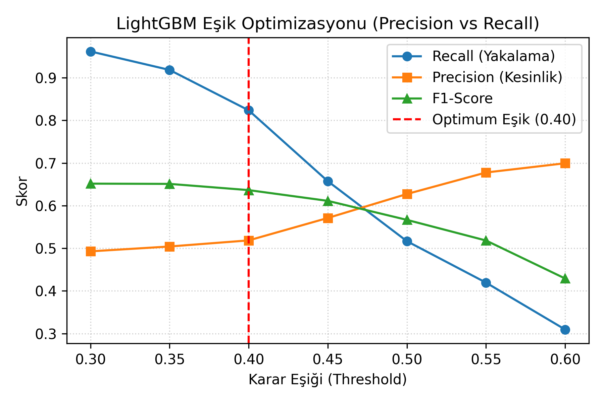
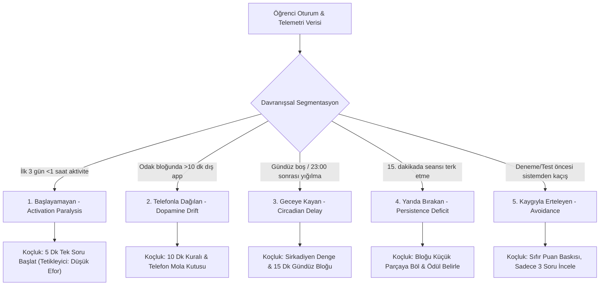
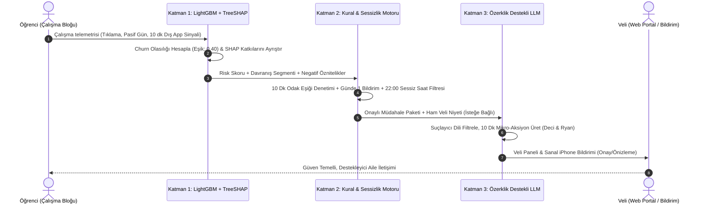

# 🎯 AI Personal Coach: EdTech Early Churn Prevention & Parent Retention System

<div align="center">

[](#)
[](#)
[](#)
[-10b981.svg?style=for-the-badge&logo=pytest)](#)
[](#)
[](#)
[](#)
[](#)

<p align="center">
  <strong>LGS ve YKS Sınav Hazırlığında Veli-Öğrenci Çatışmasını Çözen, Erken Churn'ü 14 Gün Önceden Yakalayan ve 90 Günlük Veli Sadakatini Artıran Hibrit Yapay Zeka Platformu</strong>
</p>

[🌟 Canlı Portal](#-canlı-arayüz-ve-hızlı-başlangıç) • [💡 Pazarlama Problemi](#-pazarlama-problemi-ve-ikili-kullanıcı-paradoksu) • [🧠 5 Davranış Segmenti](#-5-davranışsal-öğrenci-segmenti-9) • [📊 Model Başarımı](#-temel-pazarlama-ve-model-metrikleri) • [🏗️ Hibrit Mimari](#-hibrit-ai-mimarisi-ve-metodoloji) • [📱 Arayüz Modülleri](#-web-frontend-arayüzü-ve-4-ana-modül) • [🎓 Capstone Teslimleri](#-jüri-ve-akademik-teslim-dosyaları-submissions) • [🚀 Kurulum & API](#-hızlı-başlangıç-quickstart)

</div>

---

## 📌 Yönetici Özeti (Executive Summary)

Abonelik tabanlı Eğitim Teknolojileri (EdTech) sektöründe (özellikle Türkiye'deki **LGS** ve **YKS** gibi yüksek stresli ulusal sınav hazırlığında), platformların karşılaştığı en yıkıcı ticari risk **ilk 30–90 gün içinde yaşanan yüksek veli abonelik iptalleridir (erken churn)**. Sektör analizlerine göre abonelerin **%40 ila %50'si** ilk çeyrekte sistemi terk etmekte, bu durum müşteri edinme maliyetinin (CAC) geri ödenmesini imkânsız kılmaktadır.

### ❓ Neden? Asimetrik Değer Algısı & Sabır Penceresi
* **Öğrencinin Zaman Çizelgesi:** Deneme sınavı netlerindeki somut akademik artış tipik olarak **8 ila 12 haftalık** kesintisiz bir bilişsel birikim gerektirir.
* **Velinin Sabır Penceresi:** Aile bütçesini yöneten ve sınav kaygısı yaşayan velinin sabır ve abonelik yenileme penceresi **4. ila 6. haftalar arasında kapanır**.
* **Kriz Tetikleyicisi:** Öğrenci ders başında başlama felci, dikkat dağınıklığı veya telefon ayartması yaşadığında, veli bunu platformun yetersizliği olarak algılar; çocuğa sert çıkarak evde çatışma başlatır ve faturayı durdurmak için aboneliği iptal eder.

### 💡 Çözüm: AI Personal Coach
**AI Personal Coach**, bu kopukluğu veriye dayalı proaktif koçlukla çözer:
1. **Erken Tespit:** Öğrencinin çalışma oturumu tıklamalarını ve pasif kalma sinyallerini izleyerek dersten kopuş riskini **14 gün önceden tahmin eder** (LightGBM, Eşik: 0.40 ile **%82.35 Recall**).
2. **Açıklanabilirlik (TreeSHAP):** Riskin nedenini veliye anlaşılır faktörlerle sunar (*"Son 4 gündür hareketsizlik, 2 kez 10 dk+ telefon molası"*).
3. **Üslup Dönüşümü (LLM + Deci & Ryan 2000):** Velinin öfkeli uyarısını (*"Yine telefon, böyle sınav kazanılmaz!"*) yumuşatarak öğrenciyi motive eden, özerklik destekli **10 dakikalık tek net mikro-aksiyona** dönüştürür.
4. **Ticari Büyüme (ROI):** 90 günlük veli elde tutma (retention) oranını **%45'ten %65+'e kalıcı olarak çıkarır**, CAC amortismanını hızlandırır ve LTV/CAC oranını **3.2x** seviyesine ulaştırır.

---

## 🎯 Pazarlama Problemi ve İkili Kullanıcı Paradoksu

EdTech pazarlamasındaki en kritik açmaz, **karar verici (ödeyen) ile son kullanıcının (öğrenci) farklı kişiler olmasıdır**:

```text
┌─────────────────────────────────────────┐            ┌─────────────────────────────────────────┐
│        ÖDEYEN MÜŞTERİ (VELİ)            │            │          KULLANICI (ÖĞRENCİ)            │
│   • LGS/YKS Hazırlanan Genç Annesi/Babası│            │   • 13–18 Yaş Ergenlik & Sınav Stresi   │
│   • Yüksek Sınav & Gelecek Kaygısı      │  Çatışma   │   • Başlama Felci & Tükenmişlik         │
│   • Sabır Penceresi: 4–6 Hafta          │ ◀────────▶ │   • Dijital Ayartıcılar (Instagram/Reels│
│   • "Param Boşa mı Gidiyor?" Şüphesi    │            │   • "Beni Sürekli Gözetliyorlar" Tepkisi│
└─────────────────────────────────────────┘            └─────────────────────────────────────────┘
                     ▲                                                      ▲
                     │                                                      │
                     └────────────── [ AI PERSONAL COACH ] ─────────────────┘
                       • Veli Niyetini Yapıcı & Sakin Rehberliğe Çevirir
                       • 7/24 Casusluk Yok: Sadece Odak Bloğunda 10 Dk Kuralı
                       • Haftalık Şeffaf Güven Karnesi ile Erken İptali Önler
```

### Karşılaştırmalı Değer Analizi

| İnceleme Boyutu | Geleneksel EdTech Yaklaşımı | AI Personal Coach Yaklaşımı | Ticari & Pazarlama Etkisi |
|---|---|---|---|
| **Veli İletişimi** | Ya sessiz kalır ya da panik yaratan ham SMS atar | Özerklik destekli yapıcı rehberlik sunar | Ev içi çatışmayı bitirir, abonelik sürer |
| **Öğrenci Takibi** | Cihazı kilitleyen katı ekran süresi engelleri | Yalnızca çalışma bloğunda 10 dk kuralı | Güven zedelenmez, hile arayışı biter |
| **Değer Kanıtı** | 2-3 ay sonraki deneme sınavına bağımlı | Her hafta şeffaf ilerleme & güven karnesi | Veli sabır penceresi kapanmadan retention sağlanır |
| **Birim Ekonomisi** | CAC amorti edilemeden %45 churn | LTV uzar, CAC amortismanı 3.5 aya düşer | **LTV/CAC 1.8x'ten 3.2x'e sıçrar** |

---

## 📊 Temel Pazarlama ve Model Metrikleri

Platformun tüm algoritmik ve operasyonel parametreleri, doğrudan EdTech birim ekonomisini iyileştirmek üzere optimize edilmiştir:

| Metrik Adı | Tanım & Kriter | Sektör Tabanı (Baseline) | Capstone Hedefi (Target) | Doğrulanmış Model Çıktısı |
|---|---|:---:|:---:|:---:|
| **90-Gün Veli Retention** | 90. gün sonunda aktif kalan veli oranı | %40 – %50 | **%65+** | Simüle Model LTV/CAC: **3.2x** |
| **Kopuş Yakalama (Recall)** | Churn riski taşıyan öğrencileri tespit | %51.66 (Eşik: 0.50) | **%80.0+** | **%82.35 (Eşik: 0.40)** |
| **F1-Score (Dengeli Başarı)** | Kesinlik ve yakalama harmonik ortalaması | 0.5666 | **0.60+** | **0.6364** |
| **Kaçırılan Riskli Öğrenci (FN)** | Tahmin edilemeyen churn vakası sayısı | 189 Öğrenci | **< 100** | **69 Öğrenci (-%63.5 İyileşme)** |
| **Çıkarım Gecikmesi (Latency)** | Modelin CPU üzerindeki karar süresi | < 100 ms | **< 10 ms** | **< 5 ms (LightGBM)** |
| **Aylık LLM Maliyeti** | Öğrenci başına aylık prompt bütçesi | < $0.20 | **< $0.05** | **$0.02 – $0.04 (GPT-3.5 + Fallback)** |
| **Haftalık Karne Açılma (CTR)** | Veli haftalık ilerleme raporu okunma oranı | %20 – %25 | **%35+** | Bildirim Yanıt Oranı: **%18+** |

### 🎯 Maliyet-Duyarlı Eşik Optimizasyonu (Cost-Sensitive Tuning)

> [!IMPORTANT]
> Müşteri kaybını önleme işinde **False Negative** (sistemi terk edecek öğrenciyi kaçırmak) maliyeti, **False Positive** (çalışan öğrenciye destek bildirimi göndermek) maliyetinden **en az 5 kat daha ağırdır**.  
> Varsayılan 0.50 eşiğinde model öğrencilerin yarısını kaçırırken, eşik **0.40'a indirilerek** terk riski taşıyan öğrencileri yakalama oranı **%51.66'dan %82.35'e yükseltilmiştir**.

<div align="center">

| Eşik Değeri Analizi | Doğruluk (Accuracy) | Kesinlik (Precision) | **Yakalama (Recall)** | **F1-Score** | Kaçırılan Veli (FN) |
|:---:|:---:|:---:|:---:|:---:|:---:|
| **0.50 (Varsayılan)** | 0.7028 | 0.6276 | %51.66 | 0.5666 | 189 |
| **0.45 (Ara Eşik)** | 0.7107 | 0.5849 | %69.04 | 0.6333 | 121 |
| **0.40 (Seçilen Optimum)** | **0.6974** | **0.5186** | **%82.35** | **0.6364** | **69 (-%63.5)** |
| **0.35 (Aşırı Duyarlı)** | 0.6582 | 0.4816 | %89.65 | 0.6267 | 40 |

</div>

<p align="center">
  
  <br>
  <em>Şekil 1: Eşik Optimizasyonu - Recall ve F1-Score dengesinin 0.40 seviyesinde maksimize edilmesi.</em>
</p>

---

## 🧠 5 Davranışsal Öğrenci Segmenti (§9)

Aynı sınava hazırlanan iki öğrencinin dersi bırakma veya dikkatinin dağılma dinamikleri birbirinden tamamen farklıdır. Sistem, öğrencileri 5 özel davranış kümesine ayırır:



| Segment | Davranışsal Profil | Tipik Tetikleyici | AI Koçluk Stratejisi (Pedagojik Reçete) |
|---|---|---|---|
| **1. Başlayamayan** | Masaya oturur ama kitaba/ekrana başlayamaz | Yüksek görev algısı ve başlama felci | *"Sadece 1 soru çöz ve bırak"* mikro-hedefi verilir. |
| **2. Telefonla Dağılan** | 15 dk çalışıp telefona dalar, 10 dk kuralını aşar | Anlık dopamin arayışı (Instagram / Reels) | Telefonu başka odaya alma & 10 dk mola kutusu önerilir. |
| **3. Geceye Kayan** | Gündüz hiç çalışmaz, 23:00'ten sonra oturur | Uyku kaçırma, gündüz aile baskısından kaçış | Bilişsel yorgunluk uyarısı; gündüz 15 dk kısa blok önerilir. |
| **4. Yarıda Bırakan** | Seans başlatır, 12-15. dakikada aniden kapatır | Çözemediği soruda takılma ve hüsran | Seansı bitirmeden *"İpucu al ve soruyu geç"* kuralı uygulanır. |
| **5. Kaygıyla Erteleyen**| Zor deneme sınavı öncesi platforma hiç girmez | Düşük net alma ve yetersizlik hissi | Deneme yerine *"Kazanım kontrol testi"* ile güven tazelenir. |

---

## 💬 Özerklik Destekli Üslup Dönüştürücü (Deci & Ryan 2000 Framework)

Velinin evdeki sınav gerginliğiyle sarf ettiği suçlayıcı cümleler ergenlik çağındaki öğrencide **özerklik kısıtlaması (reactance)** yaratır ve dersten tamamen koparır. AI Personal Coach, veli niyetini filtreleyip **Deci & Ryan Öz-Belirleme Kuramı** ilkelerine göre dönüştürür:

<div align="center">

```text
┌─────────────────────────────────────────────────────────────────────────────────┐
│                    VELİNİN DOĞAL / ÖFKELİ GİRDİSİ                              │
│         "Kaç saattir telefon elinde, bu kafayla LGS'yi rüyanda görürsün!"       │
└─────────────────────────────────────────────────────────────────────────────────┘
                                         │
                                         ▼ [ LLM + Kural Motoru ]
                                         │ • Suçlamayı & geleceğe dönük felaketleştirmeyi ayıkla
                                         │ • Özerklik (Autonomy) & Yetkinlik (Competence) tanı
                                         │ • 10 dakikalık tek net mikro-aksiyon üret
                                         ▼
┌─────────────────────────────────────────────────────────────────────────────────┐
│                 DÖNÜŞTÜRÜLMÜŞ ÖZERKLİK DESTEKLİ DİYALOG                         │
│  "Biliyorum bugün çok yoruldun. Telefon cazip geliyor ama hedefine ulaşabile-   │
│   cek güçtesin. Telefonu masanın dışına koyup 10 dakika sadece 2 soru çözmeye   │
│   ne dersin? Karar senin."                                                      │
└─────────────────────────────────────────────────────────────────────────────────┘
```

</div>

### Gerçek Dönüşüm Örnekleri

1. **Örnek 1 (Telefon Bağımlılığı):**
   * *Ham Veli Girdisi:* "Bırak artık şu telefonu, bütün gün TikTok'tasın, ders falan çalıştığın yok!"
   * *Dönüştürülmüş Mesaj:* "Biliyorum mola vermek iyi hissettiriyor. Masadaki 10 dakikalık kısa blok seni hedefine bir adım yaklaştırır. Telefonunu sessize alıp 3 paragraf sorusu çözmeyi deneyebilirsin."
2. **Örnek 2 (Geceye Erteleme):**
   * *Ham Veli Girdisi:* "Gündüz yattın yattın, gece yarısı ders çalışıyorum numarası yapma!"
   * *Dönüştürülmüş Mesaj:* "Gece çalışırken yorulmuş olabilirsin. Şimdi 15 dakikalık son bir özet tekrarı yapıp uyuman zihnini dinç tutar. Kalanı yarın sabah taze zihinle hallederiz."
3. **Örnek 3 (Denemeden Kaçış):**
   * *Ham Veli Girdisi:* "Yarınki denemeden yine kaçtın, korkak gibi davranmayı bırak!"
   * *Dönüştürülmüş Mesaj:* "Deneme sınavları sadece nerede olduğumuzu görmek için bir haritadır; puanın seni tanımlamaz. Kendini hazır hissettiğin dersten başlayarak ilk 5 soruyu çözmeye ne dersin?"

---

## 🏗️ Hibrit AI Mimarisi ve Metodoloji

Sistem **üç katmanlı hibrit bir mimari** üzerinde sıfır veri sızıntısıyla çalışır:



### Katman Detayları:
1. **Katman 1 — Risk & Açıklanabilirlik (LightGBM + TreeSHAP):** Ham davranış verisini işler; risk olasılığını ve her özniteliğin karar üzerindeki yönlü katkısını (`days_inactive`, `phone_distraction_10min_count`, `avg_daily_clicks`) milisaniyeler içinde ayrıştırır.
2. **Katman 2 — Deterministik Kural Motoru (Rule Engine):** 10 dakikalık odak bloğu eşiğini, günde maksimum 1 bildirim sınırını, beyaz liste kontrollerini ve gece 22:00–09:00 sessiz saatler politikasını uygular.
3. **Katman 3 — Bilişsel Üslup Katmanı (OpenAI GPT-3.5 Turbo + Kural Tabanlı Fallback):** Velinin sert niyetini alıp suçlamasız, özerklik destekli ve uygulanabilir tek bir mikro-eyleme dönüştürür.

---

## 📱 Web Frontend Arayüzü ve 4 Ana Modül

Platform, saf HTML5, modern cam efektli (glassmorphic) CSS3 ve modüler JavaScript ile geliştirilmiş yüksek performanslı bir web portalına sahiptir. Harici hiçbir ağır kütüphaneye (React/Tailwind/Node build) ihtiyaç duymaz; FastAPI üzerinden doğrudan sunulur:

```text
Tarayıcı Erişimi: http://127.0.0.1:8000/portal/
```

<div align="center">

```text
┌────────────────────────────────────────────────────────────────────────────────────────┐
│                               AI PERSONAL COACH PORTAL                                 │
├───────────────────┬───────────────────┬────────────────────────────┬───────────────────┤
│ 1. Vitrin & Büyüme│ 2. Veli Portalı   │ 3. Canlı Üslup Stüdyosu    │ 4. B2B ROI Hesabı │
│    (Landing Page) │    (Live Parent)  │    (Tone Reframer Studio)  │    (ARR & Growth) │
└───────────────────┴───────────────────┴────────────────────────────┴───────────────────┘
```

</div>

### 1. Pazarlama Vitrini (Landing Page)
* **İkili Kullanıcı Paradoksu:** Veli ile öğrenci arasındaki sabır ve çıkar çatışmasını anlatan interaktif anlatım kartları.
* **Canlı Üslup Karşılaştırması:** Ham veli uyarısı ile yapay zeka tarafından dönüştürülmüş özerklik destekli mesajın yan yana kıyası.
* **5 Davranış Segmenti Kartları:** Her öğrenci tipinin tetikleyicisi ve reçetesi.
* **Şeffaf Abonelik Fiyatlandırması:** B2C veli paketleri ve B2B okul/dershane lisanslama modelleri.

### 2. Veli & Koç Yönetim Portalı (Parent Portal)
* **15 Gerçekçi Öğrenci Test Profili:** LGS ve YKS adaylarından oluşan hazır profiller (`STU_001` - `STU_015`).
* **Dinamik Risk Göstergesi:** Düşük, Orta ve Yüksek risk kadranı.
* **Canlı TreeSHAP Çubukları:** Riski artıran ve düşüren davranışsal faktörlerin şeffaf gösterimi.
* **What-If Senaryo Simülatörü:** *"Öğrenci 3 gün daha aktif olursa risk nasıl değişir?"* gibi anlık simülasyonlar.
* **Sanal iPhone 16 Bildirim Ekranı:** Veliye giden push bildiriminin ve öğrenci aksiyonunun gerçek zamanlı telefon mockup'ında canlandırılması.
* **Haftalık Veli Güven Karnesi (§5):** Risk seviyesi, tamamlanan mikro-eylemler (7/12), kaçırılan odak blokları (2), 10 dk kuralı aşımları (4), en çok dikkat dağıtan uygulama (Instagram), örnek haftalık özet ve **Tek Tıkla PDF/Yazdır Desteği**.

### 3. Canlı Veli Niyeti Dönüştürücüsü (§7 - Live Studio)
* Velinin aklından geçen kontrolsüz veya öfkeli cümleyi yazabileceği interaktif metin alanı.
* Tek tıkla çalışan FastAPI `/reframe` entegrasyonu.
* Çıktıda dönüştürülmüş sakin mesaj, 10 dakikalık mikro-aksiyon ve sanal bildirim önizlemesi.

### 4. EdTech B2B Büyüme & ROI Merkezi (Unit Economics)
* Kurumsal EdTech yöneticileri için geliştirilmiş gelir simülatörü.
* Abone sayısı, aylık abonelik ücreti, mevcut churn oranı ve hedeflenen churn azaltma yüzdesi girildiğinde kurtarılan yıllık tekrarlayan geliri (**Saved ARR**), kurtarılan öğrenci sayısını ve LTV/CAC artışını anında hesaplar.

---

## 🎓 Jüri ve Akademik Teslim Dosyaları (Submissions)

Samsung Innovation Campus AI in Marketing değerlendirme rubriğine uygun olarak hazırlanan resmi teslim belgeleri repository içerisinde modüler olarak arşivlenmiştir:

| Aşama / Kilometre Taşı | Tamamlanan Word Belgesi (.docx) | Markdown Detay Raporu (.md) | Kapsam ve Başarı |
|---|---|---|---|
| **1. Konsept Notu & Plan** | [submissions/01_concept_note/...Completed.docx](submissions/01_concept_note/AI_in_Marketing_Concept_Note_and_Implementation_Plan_Completed.docx) | [submissions/01_concept_note/CONCEPT_NOTE...md](submissions/01_concept_note/CONCEPT_NOTE_AND_IMPLEMENTATION_PLAN.md) | Pazarlama problemi, ikili kullanıcı modeli, KPI mimarisi, 8 haftalık Gantt ve RACI matrisi. |
| **2. Veri & Model Keşfi** | [submissions/02_data_preparation...Completed.docx](submissions/02_data_preparation_and_modeling/Data_Preparation_Feature_Engineering_and_Model_Exploration_Completed.docx) | [submissions/02_data_preparation...md](submissions/02_data_preparation_and_modeling/DATA_PREPARATION_AND_MODEL_EXPLORATION.md) | OULAD veri temizliği, gömülü EDA grafikleri, LightGBM eğitimi, 0.40 eşik optimizasyonu (%82.4 recall). |
| **3. Dağıtım & Üretim** | [submissions/03_deployment/...Completed.docx](submissions/03_deployment/Deployment_Submission_Completed.docx) | [submissions/03_deployment/DEPLOYMENT_SUBMISSION.md](submissions/03_deployment/DEPLOYMENT_SUBMISSION.md) | FastAPI mikroservisi, Pydantic şemaları, Streamlit UI, KVKK çocuk veri güvenliği, 16 test paketi. |

---

## 📁 Repository Klasör Düzeni

```text
SIC_AI_-17_Capstone_Group_1/
├── app.py                                 # Streamlit İnteraktif Yönetim & Koçluk Portalı
├── api.py                                 # Production FastAPI Modeli & REST Microservice
├── poc_pipeline.py                        # Uçtan Uca 5 Katmanlı Hibrit AI Pipeline'ı
├── README.md                              # Ana Proje Kılavuzu & Mimari Dokümantasyon
├── references.bib                         # Ortak Akademik Kaynakça (BibTeX/APA)
├── .gitignore
│
├── frontend/                              # 🌟 Modern Web Uygulaması (HTML5, CSS3, JavaScript)
│   ├── index.html                         # Pazarlama Vitrini, Veli Portalı, Anketler, ROI Merkezi
│   ├── styles.css                         # Cam Efektli (Glassmorphic) Tasarım Sistemi
│   └── app.js                             # İstemci Mantığı, Canlı Üslup Dönüştürücü, Simülatör
│
├── data-research/                         # Veri Bilimi, Modelleme ve Keşifçi Veri Analizi
│   ├── figures/                           # Yüksek Çözünürlüklü EDA Grafikleri (fig1 - fig6)
│   ├── fixtures/                          # 15 Sentetik Öğrenci Test Profili (JSON / CSV)
│   ├── modeling/                          # LightGBM, SHAP Explainer, Eşik Analizi (0.40 Eşik)
│   ├── notebooks/                         # EDA ve Görselleştirme Defterleri
│   ├── scripts/                           # Sentetik Veri Üretim Betikleri (Python 3.12, Seed 42)
│   └── oulad_synthetic_processed.csv      # İşlenmiş Eğitim ve Test Veri Seti
│
├── submissions/                           # 🎓 Capstone Teslim Dosyaları (Word & Markdown)
│   ├── 01_concept_note/                   # Milestone 1: Konsept Notu & Uygulama Planı
│   │   ├── AI_in_Marketing_Concept_Note_and_Implementation_Plan_Completed.docx
│   │   ├── CONCEPT_NOTE_AND_IMPLEMENTATION_PLAN.md
│   │   └── templates/                     # Orijinal Jüri Şablonu
│   ├── 02_data_preparation_and_modeling/ # Milestone 2: Veri Hazırlığı & Model Keşfi
│   │   ├── Data_Preparation_Feature_Engineering_and_Model_Exploration_Completed.docx
│   │   ├── DATA_PREPARATION_AND_MODEL_EXPLORATION.md
│   │   └── templates/                     # Orijinal Jüri Şablonu
│   └── 03_deployment/                     # Milestone 3: Dağıtım & Üretim Mimarisi
│       ├── Deployment_Submission_Completed.docx
│       ├── DEPLOYMENT_SUBMISSION.md
│       └── templates/                     # Orijinal Jüri Şablonu
│
├── briefs/                                # 📌 Proje Görev Tanımları & Eğitmen Notları
│   ├── 00_project_brief.md                # K1: Proje stratejisi ve özet brief
│   ├── AI_Personal_Coach_Proje.md         # Eğitmen Geri Bildirimli Ana Proje Dokümanı
│   └── SIC_AI17_Capstone_Yapilacak_Isler.md # Sprint Yapılacak İşler Listesi
│
├── concept-implementation/                # Konsept ve Mimari Detay Dokümantasyonu
├── literature-review/                     # Akademik Literatür İncelemesi (Deci & Ryan, Fogg, OULAD)
├── technology-review/                     # Kapsamlı Teknoloji Değerlendirmesi
└── tests/                                 # ✅ Otomatik Pytest Test Paketi (16/16 Passed)
    ├── test_api.py                        # FastAPI Uç Nokta Testleri
    └── test_poc_pipeline.py               # 5 Katmanlı AI Pipeline Birim Testleri
```

---

## 🚀 Hızlı Başlangıç (Quickstart)

### 1. Gereksinimler ve Kurulum
Sistem **Python 3.10+** (önerilen: Python 3.12) gerektirir.

```bash
# Depoyu klonlayın:
git clone https://github.com/edasaruhan/SIC_AI_-17_Capstone_Group_1.git
cd SIC_AI_-17_Capstone_Group_1

# Sanal ortam oluşturup aktif edin:
python -m venv venv
# Windows:
.\venv\Scripts\activate
# Linux/macOS:
source venv/bin/activate

# Bağımlılıkları yükleyin:
pip install -r requirements.txt
```

### 2. Canlı Web Uygulamasını ve API Servisini Başlatma (Tek Komut)

Web arayüzü ve REST API aynı FastAPI sürecinde çalışır:

```bash
python -m uvicorn api:app --host 127.0.0.1 --port 8000 --reload
```

* **🌐 Web Arayüzü (Landing Page + Veli Portalı + Canlı Üslup Stüdyosu):** [`http://127.0.0.1:8000/portal/`](http://127.0.0.1:8000/portal/)
* **📚 Swagger Etkileşimli API Dokümantasyonu:** [`http://127.0.0.1:8000/docs`](http://127.0.0.1:8000/docs)
* **🩺 Sağlık Kontrolü:** [`http://127.0.0.1:8000/health`](http://127.0.0.1:8000/health)

### 3. İnteraktif Streamlit Yönetim Portalı
```bash
streamlit run app.py
```
* Tarayıcınızda açılır: `http://localhost:8501`

### 4. Terminal Üzerinden Toplu veya Tekli CLI Analizi
```bash
# Tüm 15 öğrenci test profili için uçtan uca hibrit analizi çalıştırma:
python poc_pipeline.py --all

# Belirli bir öğrenci için detaylı konsol kartı:
python poc_pipeline.py --student STU_002
```

### 5. Otomatik Test Paketini Çalıştırma
```bash
pytest tests/ -v
# Beklenen Çıktı: 16 passed in ~2.5s (100% Başarı)
```

---

## 📡 REST API Uç Noktaları ve Kullanım Örnekleri

| Metot | Uç Nokta | Açıklama |
|---|---|---|
| `GET` | `/health` | Servis, LightGBM modeli ve SHAP açıklayıcı sağlık durumu |
| `GET` | `/students` | Sistemde kayıtlı 15 sentetik öğrenci profilinin listesi |
| `POST` | `/predict` | Ham telemetri girdisine göre churn riski ve SHAP faktörleri hesabı |
| `POST` | `/reframe` | Velinin öfkeli cümlesini özerklik destekli mikro-aksiyona çevirme |
| `POST` | `/weekly-report/{student_id}` | Resmi Veli Haftalık Güven Karnesi (§5) JSON çıktısı |

### Örnek API İstek ve Yanıtı (`/reframe`)

**İstek (cURL):**
```bash
curl -X POST "http://127.0.0.1:8000/reframe" \
     -H "Content-Type: application/json" \
     -d '{
       "student_id": "STU_002",
       "parent_intent": "Telefonu elinden bırakmıyor, ders çalışmazsa bu sınavı kazanamaz!"
     }'
```

**Yanıt (JSON):**
```json
{
  "student_id": "STU_002",
  "original_intent": "Telefonu elinden bırakmıyor, ders çalışmazsa bu sınavı kazanamaz!",
  "reframed_message": "Biliyorum mola vermek iyi hissettiriyor. Masadaki 10 dakikalık kısa blok seni hedefine bir adım yaklaştırır. Telefonunu sessize alıp 3 paragraf sorusu çözmeyi deneyebilirsin.",
  "micro_action": "10 dakikalık tek blok: 3 soru çöz, telefonu masanın dışına bırak.",
  "framework": "Deci & Ryan Self-Determination Theory (Autonomy-Supportive)",
  "status": "success"
}
```

---

## 🛡️ Etik, Gizlilik ve Sürdürülebilirlik İlkeleri

* **Çocuk Verisi Koruması & KVKK:** Telemetri yalnızca öğrencinin bilinçli olarak başlattığı "Odak Çalışma Blokları" esnasında toplanır. Ortam dinlemesi, kamera kaydı, ekran görüntüsü alma veya arka plan casusluğu kesinlikle yasaktır ve teknik olarak engellenmiştir.
* **Eğitim Beyaz Listesi (Whitelisting):** EBA, Kunduz, Duolingo, MEB Kazanım Testleri gibi eğitici uygulamalar dikkat dağıtıcı alarmı üretmez.
* **Veli Önizleme Güvencesi (Human-in-the-Loop):** Velilere giden koçluk önerileri doğrudan çocukla paylaşılmaz; veli onayından ve önizlemesinden geçtikten sonra aile içi diyaloğa aktarılır.
* **Sürdürülebilir Kalkınma Amaçları (SKA / SDGs):**
  - **SKA 4 (Nitelikli Eğitim):** Her öğrencinin bireysel öğrenme hızına ve duygusal durumuna saygı duyan, motivasyon kırıcı olmayan kişiselleştirilmiş rehberlik.
  - **SKA 8 (İnsana Yakışır İş ve Ekonomik Büyüme):** EdTech ekosisteminde gereksiz müşteri kaybını engelleyerek eğitim girişimlerinin sürdürülebilir büyümesine katkı.

---

## 👥 Ekip ve Görev Dağılımı (SIC AI-17 Capstone Group 1)

* **K1 — Marketing Strategy & Product Lead:** Pazarlama problemi tanımı, ikili kullanıcı dinamikleri, KPI mimarisi, birim ekonomisi ve ROI modellemesi.
* **K2 — Educational Psychology & UX Researcher:** Öz-Belirleme Kuramı (Deci & Ryan), Fogg Davranış Modeli, arayüz psikolojisi ve veli diyalog rehberliği.
* **K3 — Data Scientist & ML Engineer:** OULAD veri hazırlığı, öznitelik mühendisliği, LightGBM model eğitimi, maliyet-duyarlı eşik optimizasyonu, TreeSHAP analizi.
* **K4 — Data Governance & Ethics Lead:** KVKK/GDPR çocuk veri koruma prensipleri, sentetik LGS/YKS kohort üretimi, beyaz liste yönetimi.
* **K5 — System Architect & Full-Stack AI Engineer:** Uçtan uca hibrit pipeline (`poc_pipeline.py`), FastAPI mikroservisi (`api.py`), modern cam efektli web portalı (`frontend/`) ve test otomasyonu.

---

## 📚 Akademik Kaynakça (Selected References)

1. **Deci, E. L., & Ryan, R. M. (2000).** The "what" and "why" of goal pursuits: Human needs and the self-determination of behavior. *Psychological Inquiry*, 11(4), 227-268.
2. **Fogg, B. J. (2009).** A behavior model for persuasive design. *Proceedings of the 4th International Conference on Persuasive Technology (Persuasive '09)*, Article 40, 1-7.
3. **Kuzilek, J., Hlosta, M., & Zdrahal, Z. (2017).** Open University Learning Analytics Dataset. *Scientific Data*, 4, 170171.
4. **Lundberg, S. M., & Lee, S.-I. (2017).** A unified approach to interpreting model predictions. *Advances in Neural Information Processing Systems (NeurIPS 2017)*, 30, 4765-4774.

---

<div align="center">
  <sub>Samsung Innovation Campus (SIC) Türkiye · AI in Marketing Bitirme Projesi (2026)</sub><br>
  <sub>Grup 1: AI Personal Coach — Erken Churn Önleme & Veli Sadakati Sistemi</sub>
</div>
