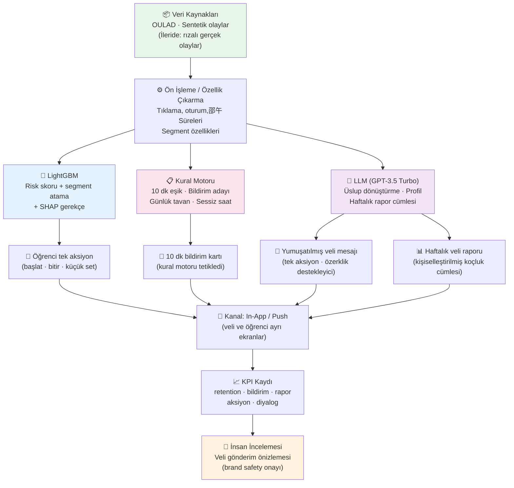

# §5 — Sistem Mimarisi: Veri Akışı ve Bileşen Diyagramı

**Proje:** AI Personal Coach  
**Yazar:** K5 — Methodology, Mimari, Stack  
**Hazırlayan:** Berat Erol ÇelİK  
**Tarih:** 2026-08-23  
**Format:** Mermaid diyagramı + açıklama

---

## Mimari Diyagram

### Rıza ve Sınırlı İzleme Kutusu

Diyagramın her adımında geçerli olan biringeri kural:

> **Rıza / Odak-Sınırlı İzleme:** Veri toplama yalnızca öğrencinin "Çalışma Modunu Başlat" butonuna bastığı anda başlar, çalışma bloğu bittiğinde kesilir. Odak bloğu dışında cihaz etkileşimi izlenmez. 18 yaş altı veli açık rızası zorunludur (KVKK).

---

## Diyagram Açıklamaları

### Veri Kaynakları

OULAD açık benchmark'ı (32.593 öğrenci, ~10.6 milyon tıklama) risk modeli için proxy veri sağlar. Sentetik katman (veli mesajları, anket profilleri, odak oturumları, telefon olayları), OULAD'da olmayan ürün-spesifik senaryoları kapsar. Gerçek pilot verisi **bu teslimde yoktur.** İleride rızalı gerçek olay verisi eklenmesi planlanır; ancak MVP'de yalnızca açık ve sentetik veri kullanılır.

### Ön İşleme / Özellik Çıkarma

OULAD'ın `studentVle` tablosundaki günlük tıklama özetleri (`sum_click`), oturum süreleri ve assessment puanları; sentetik verideki `phone_events`, `focus_sessions` ve `parent_profiles` tabloları birleştirilerek öğrenci başına özellik vektörü oluşturulur. Kategorik değişkenler (sınav türü, sınıf, segment) LightGBM'in doğal kategorik desteği sayesinde one-hot encoding olmadan doğrudan modele beslenebilir.

### Paralel İşlem Katmanları

Üç katman bağımsız çalışır:

- **LightGBM:** Her tetiklemede (kural motoru veya periyodik) güncellenmiş özellik vektörünü alır, 0.00–1.00 arası risk skoru ve en baskın 2–3 SHAP özelliği döndürür. Bu bilgi hem bildirim kararını hem de LLM prompt'unu besler.
- **Kural Motoru:** Deterministik "Eğer-Öyleyse" kuralları işletir. Odak bloğunda ≥10 dakika dikkat dağıtıcı tespit edildiğinde bildirim adayı üretir; aynı öğrenciye günde en fazla 1 bildirim gönderilir; gece 22:00–09:00 arası veliye bildirim geciktirilir.
- **LLM:** GPT-3.5 Turbo, temperature 0.2 ile çalışır. Üç çıkış üretir: (a) kısa profil, (b) yumuşatılmış mesaj, (c) haftalık rapor cümlesi. Kural motoru🗯️ başarısız olursa veya API çağrısı zaman aşımına uğrarsa, statik şablon (`INTENT_SOFT`) fallback olarak devreye girer.

### Çıktılar ve Kanal

Her bileşenin çıktısı, veli ve öğrenci için ayrı ekranlarda sunulur:
- **Öğrenciye:** Tek net aksiyon (ör. "25 dakikalık küçük bir başlangıç seti başlat" veya "bloğu bitir").
- **Veliye:** Yumuşatılmış bildirim (baskıcı dil yerine motive edici tek aksiyon) veya haftalık rapor.
- Bildirim kanalı olarak in-app push ve e-posta düşünülmüştür; SMS Katman B'de değerlendirilir.

### KPI Kaydı ve İnsan İncelemesi

Her etkileşim (bildirim gönderimi, rapor açılma, aksiyon tamamlama) KPI veritabanına loglanır. **İnsan incelemesi (veli gönderim önizlemesi)**, LLM'in ürettiği veli mesajının gönderilmeden önce bir editör (veya ilk aşamada ürün yöneticisi) tarafından kontrol edilmesini sağlar. Bu, brand safety riskini ve yanlış ton riskini azaltır; hüküm㎡着眼于 LLM halüsinasyonu veya sert veli metninin öğrenciye sızması senaryosunu engeller.

---

## Uzunluk Notu

Bu belge, diyagram (Mermaid) ve 300–450 kelimelik açıklamadan oluşmaktadır. K1, belgede Mermaid diyagramını gömecek veya `concept-implementation/figures/architecture.png` olarak dışa aktaracaktır. Kırık path bırakılmamıştır.
